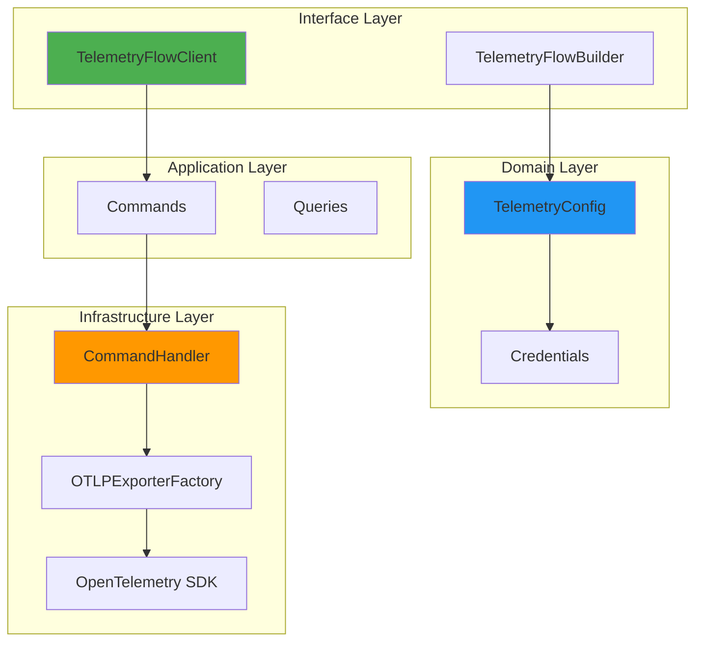
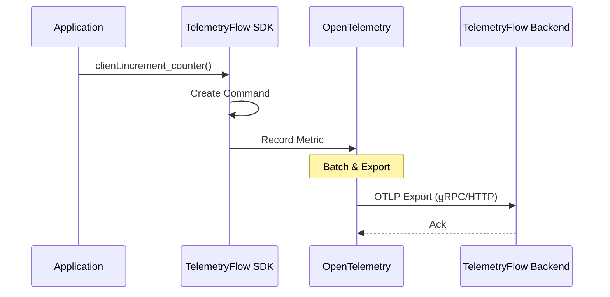

<div align="center">
  <picture>
    <source media="(prefers-color-scheme: dark)" srcset="https://github.com/telemetryflow/.github/raw/main/docs/assets/tfo-logo-sdk-dark.svg">
    <source media="(prefers-color-scheme: light)" srcset="https://github.com/telemetryflow/.github/raw/main/docs/assets/tfo-logo-sdk-light.svg">
    
  </picture>

  <h3>TelemetryFlow Python SDK</h3>

[](CHANGELOG.md)
[](https://opensource.org/licenses/Apache-2.0)
[](https://python.org)
[](https://opentelemetry.io/)
[](https://opentelemetry.io/)
[](https://hub.docker.com/r/telemetryflow/telemetryflow-python-sdk)

<p align="center">
  Enterprise-grade Python SDK for <a href="https://telemetryflow.id">TelemetryFlow</a> - the observability platform that provides unified metrics, logs, and traces collection following OpenTelemetry standards.
</p>

</div>

---

## Features

| Feature | Description |
|---------|-------------|
| **100% OTLP Compliant** | Full OpenTelemetry Protocol support |
| **DDD Architecture** | Domain-Driven Design with clean layers |
| **CQRS Pattern** | Command Query Responsibility Segregation |
| **Three Signals** | Metrics, Logs, and Traces |
| **Multiple Protocols** | gRPC (default) and HTTP |
| **Type Safety** | Full type hints with mypy support |
| **Framework Integrations** | Flask, FastAPI middleware |
| **CLI Generator** | Project scaffolding tool |

## Architecture



## Installation

```bash
pip install telemetryflow-python-sdk
```

With optional dependencies:

```bash
# HTTP framework support (Flask, FastAPI)
pip install telemetryflow-python-sdk[http]

# gRPC support
pip install telemetryflow-python-sdk[grpc]

# Development tools
pip install telemetryflow-python-sdk[dev]

# All extras
pip install telemetryflow-python-sdk[dev,http,grpc]
```

## Quick Start

### 1. Set Environment Variables

```bash
export TELEMETRYFLOW_API_KEY_ID=tfk_your_key_id
export TELEMETRYFLOW_API_KEY_SECRET=tfs_your_key_secret
export TELEMETRYFLOW_ENDPOINT=api.telemetryflow.id:4317
export TELEMETRYFLOW_SERVICE_NAME=my-python-service
export TELEMETRYFLOW_SERVICE_VERSION=1.0.0
export TELEMETRYFLOW_ENVIRONMENT=production
```

### 2. Basic Usage

```python
from telemetryflow import TelemetryFlowBuilder
from telemetryflow.application.commands import SpanKind

def main():
    # Create client from environment variables
    client = TelemetryFlowBuilder().with_auto_configuration().build()

    # Initialize the SDK
    client.initialize()

    try:
        # Record metrics
        client.increment_counter("http.requests.total", attributes={"method": "GET"})
        client.record_gauge("app.connections.active", 42)
        client.record_histogram("http.request.duration", 0.125, unit="s")

        # Emit logs
        client.log_info("Request processed", {"user_id": "123"})
        client.log_error("Database connection failed", {"db": "users"})

        # Create traces
        with client.span("process_request", SpanKind.SERVER) as span_id:
            client.add_span_event(span_id, "validation_complete")

            with client.span("database_query", SpanKind.CLIENT) as db_span:
                client.add_span_event(db_span, "query_executed", {"rows": 10})

    finally:
        # Always shutdown to flush pending data
        client.shutdown()

if __name__ == "__main__":
    main()
```

### 3. Using Context Manager

```python
from telemetryflow import TelemetryFlowBuilder

# Client auto-initializes and shuts down
with TelemetryFlowBuilder().with_auto_configuration().build() as client:
    client.increment_counter("app.started")
    client.log_info("Application running")
```

## Configuration

### Builder Pattern

```python
from datetime import timedelta
from telemetryflow import TelemetryFlowBuilder

client = (
    TelemetryFlowBuilder()
    # Credentials
    .with_api_key("tfk_your_key_id", "tfs_your_key_secret")

    # Endpoint
    .with_endpoint("api.telemetryflow.id:4317")

    # Service info
    .with_service("my-service", "1.0.0")
    .with_service_namespace("platform")
    .with_environment("production")

    # Protocol
    .with_grpc()  # or .with_http()
    .with_insecure(False)

    # Signals
    .with_signals(metrics=True, logs=True, traces=True)
    .with_exemplars(True)

    # Advanced
    .with_timeout(timedelta(seconds=30))
    .with_compression(True)
    .with_collector_id("collector-1")
    .with_custom_attribute("team", "platform")

    # Batch settings
    .with_batch_settings(
        timeout=timedelta(seconds=10),
        max_size=512
    )

    # Build
    .build()
)
```

### Environment Variables

| Variable | Required | Default | Description |
|----------|----------|---------|-------------|
| `TELEMETRYFLOW_API_KEY_ID` | Yes | - | API key ID (tfk_*) |
| `TELEMETRYFLOW_API_KEY_SECRET` | Yes | - | API key secret (tfs_*) |
| `TELEMETRYFLOW_ENDPOINT` | No | api.telemetryflow.id:4317 | Collector endpoint |
| `TELEMETRYFLOW_SERVICE_NAME` | Yes | - | Service name |
| `TELEMETRYFLOW_SERVICE_VERSION` | No | 1.0.0 | Service version |
| `TELEMETRYFLOW_SERVICE_NAMESPACE` | No | telemetryflow | Service namespace |
| `TELEMETRYFLOW_ENVIRONMENT` | No | production | Environment |
| `TELEMETRYFLOW_COLLECTOR_ID` | No | - | Collector ID |

## API Reference

### Metrics

```python
# Counter - monotonically increasing value
client.increment_counter("requests.total", value=1, attributes={"endpoint": "/api"})

# Gauge - point-in-time value
client.record_gauge("connections.active", 42, attributes={"pool": "default"})

# Histogram - distribution of values
client.record_histogram("request.duration", 0.125, unit="s", attributes={"method": "GET"})

# Generic metric
client.record_metric("custom.metric", 100.0, unit="count")
```

### Logs

```python
from telemetryflow.application.commands import SeverityLevel

# Convenience methods
client.log_debug("Debug message", {"key": "value"})
client.log_info("Info message", {"user_id": "123"})
client.log_warn("Warning message", {"threshold": 0.9})
client.log_error("Error message", {"error": "connection_failed"})

# Custom severity
client.log("Custom log", SeverityLevel.FATAL, {"critical": True})
```

### Traces

```python
from telemetryflow.application.commands import SpanKind

# Context manager (recommended)
with client.span("operation", SpanKind.SERVER, {"key": "value"}) as span_id:
    client.add_span_event(span_id, "checkpoint", {"progress": 50})
    # work...

# Manual span management
span_id = client.start_span("operation", SpanKind.CLIENT)
try:
    client.add_span_event(span_id, "started")
    # work...
except Exception as e:
    client.end_span(span_id, error=e)
    raise
else:
    client.end_span(span_id)
```

### Span Kinds

| Kind | Use Case |
|------|----------|
| `SpanKind.INTERNAL` | Internal operations (default) |
| `SpanKind.SERVER` | Server-side request handling |
| `SpanKind.CLIENT` | Client-side requests |
| `SpanKind.PRODUCER` | Message queue producers |
| `SpanKind.CONSUMER` | Message queue consumers |

## Framework Integration

### Flask

```python
from flask import Flask
from telemetryflow import TelemetryFlowBuilder
from telemetryflow.middleware import FlaskTelemetryMiddleware

app = Flask(__name__)

# Initialize client
client = TelemetryFlowBuilder().with_auto_configuration().build()
client.initialize()

# Add middleware
middleware = FlaskTelemetryMiddleware(
    client,
    excluded_paths=["/health", "/metrics"],
)
middleware.init_app(app)

@app.route("/")
def hello():
    return "Hello, World!"

@app.route("/health")
def health():
    return {"status": "healthy"}
```

### FastAPI

```python
from fastapi import FastAPI
from telemetryflow import TelemetryFlowBuilder
from telemetryflow.middleware import FastAPITelemetryMiddleware

app = FastAPI()

# Initialize client
client = TelemetryFlowBuilder().with_auto_configuration().build()
client.initialize()

# Add middleware
app.add_middleware(
    FastAPITelemetryMiddleware,
    client=client,
    excluded_paths=["/health"],
)

@app.get("/")
async def root():
    return {"message": "Hello, World!"}

@app.get("/health")
async def health():
    return {"status": "healthy"}
```

## CLI Generator

Generate project scaffolding:

```bash
# Initialize in current directory
telemetryflow-gen init

# Generate example code
telemetryflow-gen example --type basic
telemetryflow-gen example --type http-server

# Show version
telemetryflow-gen version
```

## Data Flow



## Project Structure

```
telemetryflow-python-sdk/
├── src/telemetryflow/
│   ├── __init__.py           # Package exports
│   ├── client.py             # Main client
│   ├── builder.py            # Builder pattern
│   ├── version.py            # Version info
│   ├── banner.py             # ASCII banners
│   ├── py.typed              # PEP 561 marker
│   ├── domain/               # Domain layer (DDD)
│   │   ├── credentials.py    # Credentials value object
│   │   └── config.py         # TelemetryConfig aggregate
│   ├── application/          # Application layer (CQRS)
│   │   ├── commands.py       # Command definitions
│   │   └── queries.py        # Query definitions
│   ├── infrastructure/       # Infrastructure layer
│   │   ├── exporters.py      # OTLP exporters
│   │   └── handlers.py       # Command handlers
│   ├── middleware/           # Framework integrations
│   │   ├── base.py
│   │   ├── flask.py
│   │   └── fastapi.py
│   └── cli/                  # CLI tools
│       └── generator.py
├── tests/                    # Test suite
│   ├── unit/                 # Unit tests by layer
│   └── integration/          # Integration tests
├── examples/                 # Example applications
│   ├── basic/
│   ├── http_server/
│   ├── grpc_server/
│   └── worker/
├── docs/                     # Documentation
│   ├── QUICKSTART.md
│   ├── ARCHITECTURE.md
│   ├── API_REFERENCE.md
│   ├── GENERATOR.md
│   ├── TESTING.md
│   └── BUILD-SYSTEM.md
├── pyproject.toml           # Project configuration
├── Makefile                 # Build automation
├── README.md
├── CHANGELOG.md
└── LICENSE
```

## Development

### Setup

```bash
# Clone repository
git clone https://github.com/telemetryflow/telemetryflow-python-sdk.git
cd telemetryflow-python-sdk

# Create virtual environment
python -m venv venv
source venv/bin/activate

# Install with dev dependencies
pip install -e ".[dev]"

# Install pre-commit hooks
pre-commit install
```

### Commands

```bash
# Run tests
make test

# Run with coverage
make test-coverage

# Lint code
make lint

# Format code
make format

# Type check
make typecheck

# Run all checks
make check

# Build package
make build
```

### Testing

```bash
# All tests
pytest

# Unit tests only
pytest tests/unit/ -v

# Integration tests
pytest tests/integration/ -v -m integration

# With coverage
pytest --cov=telemetryflow --cov-report=html
```

## Testing Strategy

| Layer | Target Coverage | Focus |
|-------|-----------------|-------|
| Domain | 90%+ | Value objects, validation |
| Application | 85%+ | Commands, queries |
| Infrastructure | 80%+ | Handlers, exporters |
| Client | 85%+ | Public API |

## Best Practices

### 1. Initialize Once

```python
# Good: Single initialization at startup
client = TelemetryFlowBuilder().with_auto_configuration().build()
client.initialize()

# Bad: Creating client per request
for request in requests:
    client = TelemetryFlowBuilder()...  # Don't do this!
```

### 2. Use Context Managers

```python
# Good: Automatic cleanup
with client.span("operation") as span_id:
    # work...

# Avoid: Manual management (error-prone)
span_id = client.start_span("operation")
# if exception, span may not end
client.end_span(span_id)
```

### 3. Graceful Shutdown

```python
# Good: Always shutdown
try:
    client.initialize()
    # application logic
finally:
    client.shutdown()

# Better: Context manager
with TelemetryFlowBuilder()...build() as client:
    # application logic
```

### 4. Meaningful Attributes

```python
# Good: Structured, low-cardinality
client.increment_counter(
    "http.requests",
    attributes={
        "http.method": "POST",
        "http.route": "/api/users",
        "http.status_code": 200,
    }
)

# Bad: High-cardinality
client.increment_counter("request", attributes={"url": full_url})
```

## Security

- **Never commit credentials**: Use environment variables
- **Use TLS**: Set `with_insecure(False)` in production
- **Rotate keys**: Regularly rotate API keys
- **Validate inputs**: SDK validates credential format

## Documentation

| Document | Description |
|----------|-------------|
| [Quick Start](docs/QUICKSTART.md) | 5-minute setup guide |
| [Architecture](docs/ARCHITECTURE.md) | DDD/CQRS design with diagrams |
| [API Reference](docs/API_REFERENCE.md) | Complete API documentation |
| [Generator](docs/GENERATOR.md) | CLI tool guide |
| [Testing](docs/TESTING.md) | Testing best practices |
| [Build System](docs/BUILD-SYSTEM.md) | Development workflow |

## Requirements

- Python 3.12+
- OpenTelemetry SDK 1.28.0+

## License

Apache License 2.0 - see [LICENSE](LICENSE) for details.

## Links

- [TelemetryFlow](https://telemetryflow.id)
- [Documentation](https://docs.telemetryflow.id)
- [Go SDK](https://github.com/telemetryflow/telemetryflow-go-sdk)
- [OpenTelemetry](https://opentelemetry.io)
