# Architecture Guide

This document provides a comprehensive overview of the TelemetryFlow Python SDK architecture, including design patterns, layer responsibilities, and data flows.

## Table of Contents

- [Overview](#overview)
- [Design Principles](#design-principles)
- [DDD Architecture](#ddd-architecture)
- [Layer Details](#layer-details)
- [CQRS Pattern](#cqrs-pattern)
- [Data Flow](#data-flow)
- [Error Handling](#error-handling)
- [Thread Safety](#thread-safety)
- [Extension Points](#extension-points)

## Overview

The TelemetryFlow Python SDK is built using **Domain-Driven Design (DDD)** principles with the **CQRS (Command Query Responsibility Segregation)** pattern. This architecture ensures clean separation of concerns, testability, and maintainability.

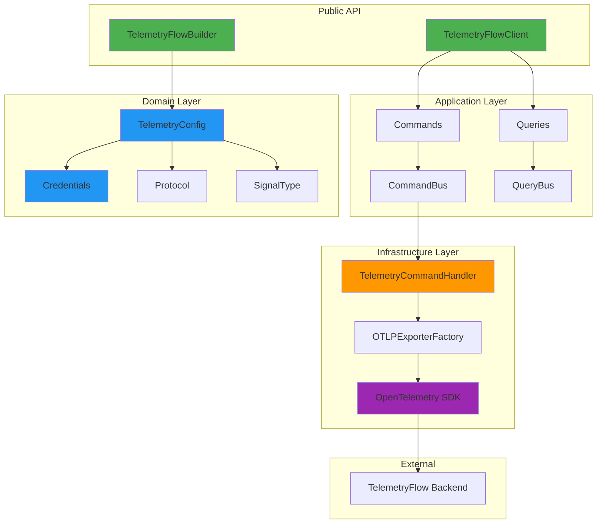

## Design Principles

### 1. Domain-Driven Design (DDD)

The SDK follows DDD tactical patterns:

| Pattern | Implementation | Purpose |
|---------|---------------|---------|
| **Aggregate Root** | `TelemetryConfig` | Encapsulates all configuration |
| **Value Object** | `Credentials` | Immutable API key pair |
| **Entity** | N/A | Not needed for SDK use case |
| **Repository** | N/A | Telemetry is write-only |

### 2. CQRS Pattern

Commands and queries are strictly separated:

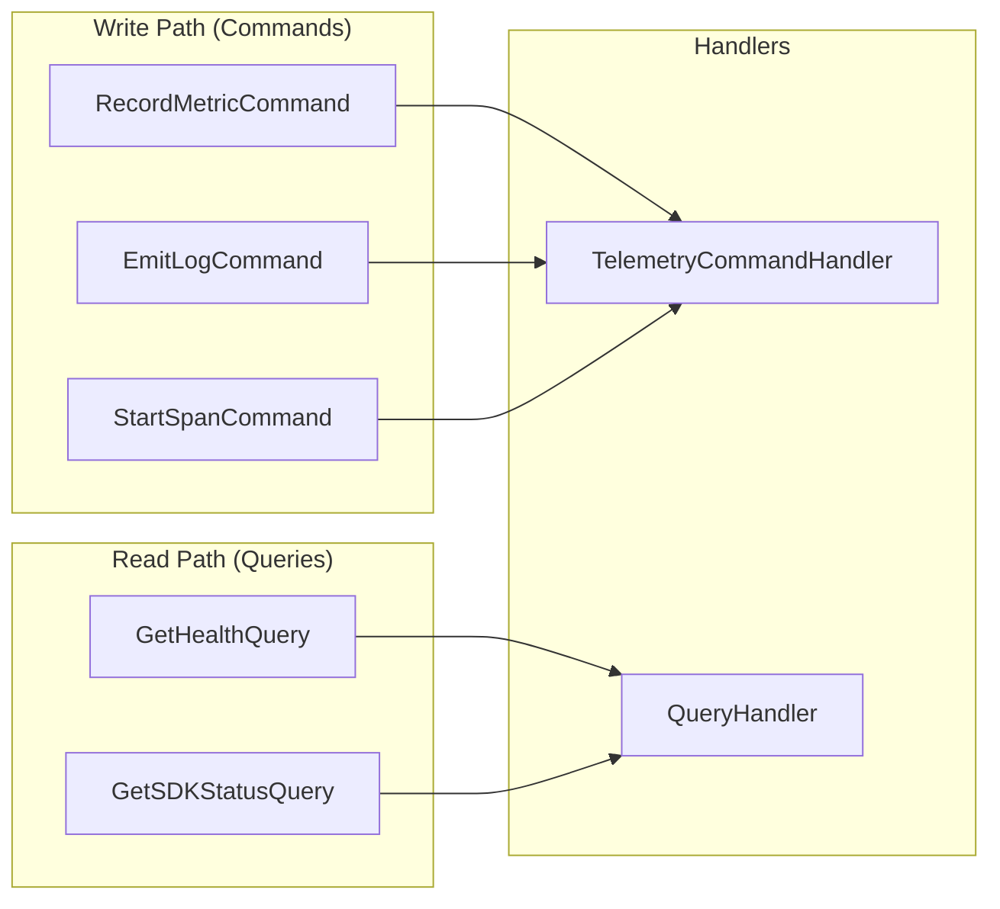

### 3. Builder Pattern

Fluent configuration API for ease of use:

```python
client = (
    TelemetryFlowBuilder()
    .with_api_key("tfk_...", "tfs_...")
    .with_endpoint("api.telemetryflow.id:4317")
    .with_service("my-service", "1.0.0")
    .with_grpc()
    .with_signals(metrics=True, logs=True, traces=True)
    .build()
)
```

### 4. Dependency Inversion

Higher-level modules don't depend on lower-level modules:

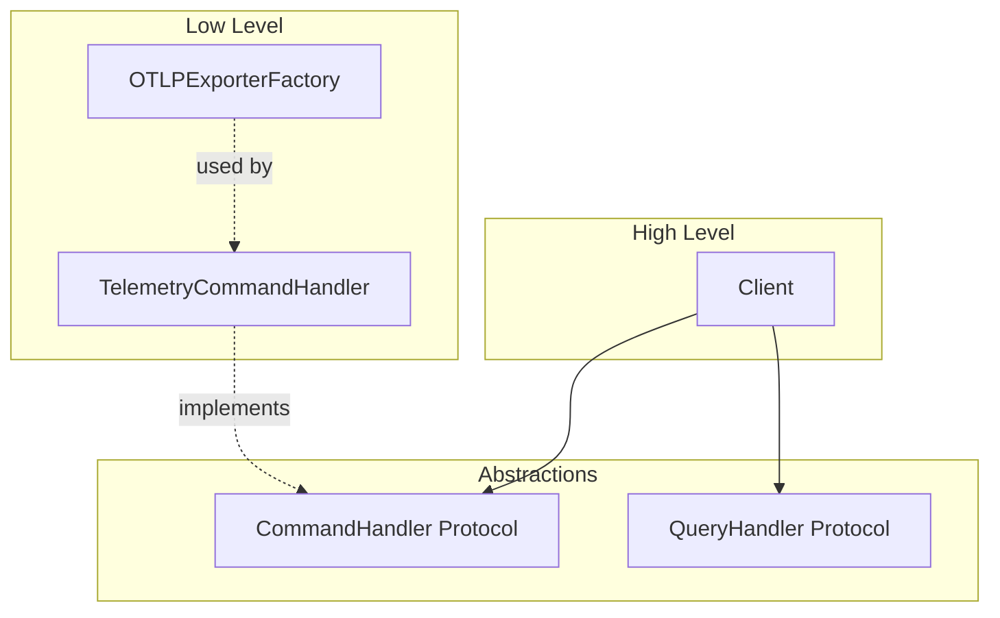

## DDD Architecture

### Bounded Contexts

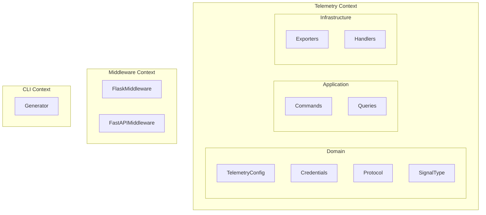

### Layer Dependencies

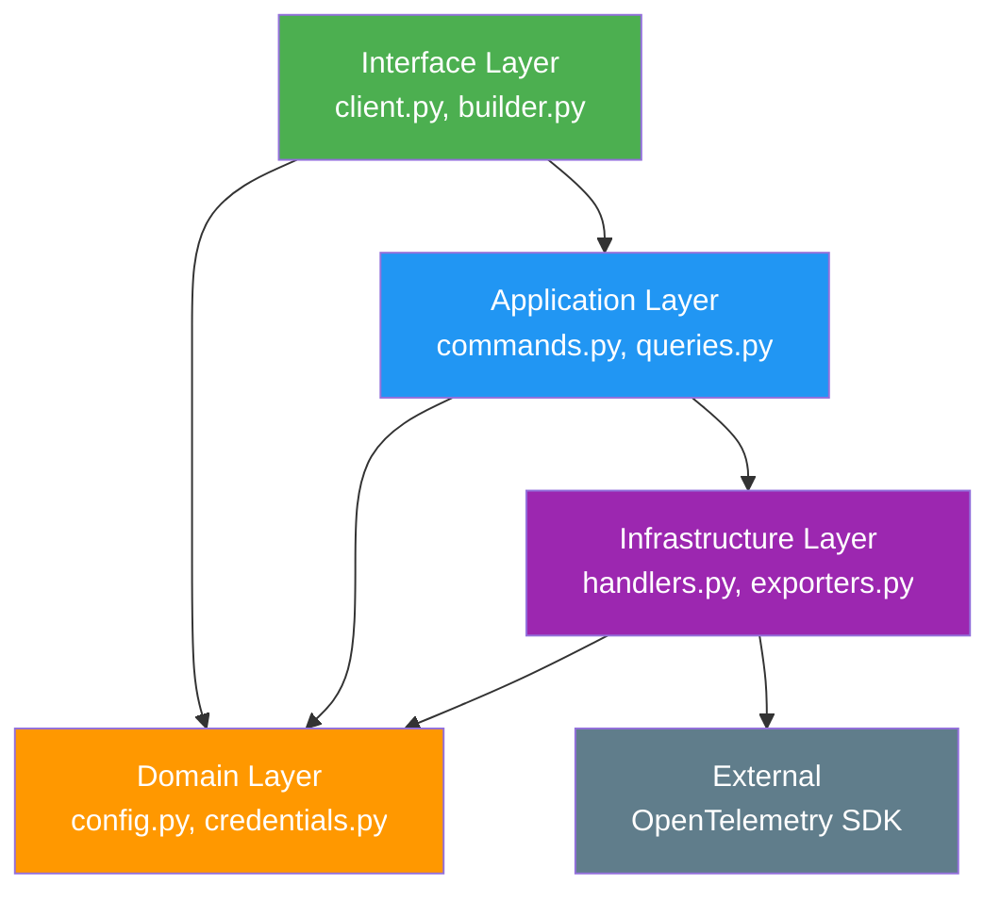

## Layer Details

### Domain Layer

**Location:** `src/telemetryflow/domain/`

The domain layer contains the core business logic and is completely independent of external frameworks.

#### Credentials (Value Object)

```python
@dataclass(frozen=True)
class Credentials:
    """Immutable API key credentials."""
    key_id: str      # Must start with 'tfk_'
    key_secret: str  # Must start with 'tfs_'

    def authorization_header(self) -> str:
        """Generate Bearer token."""
        return f"Bearer {self.key_id}:{self.key_secret}"
```

#### TelemetryConfig (Aggregate Root)

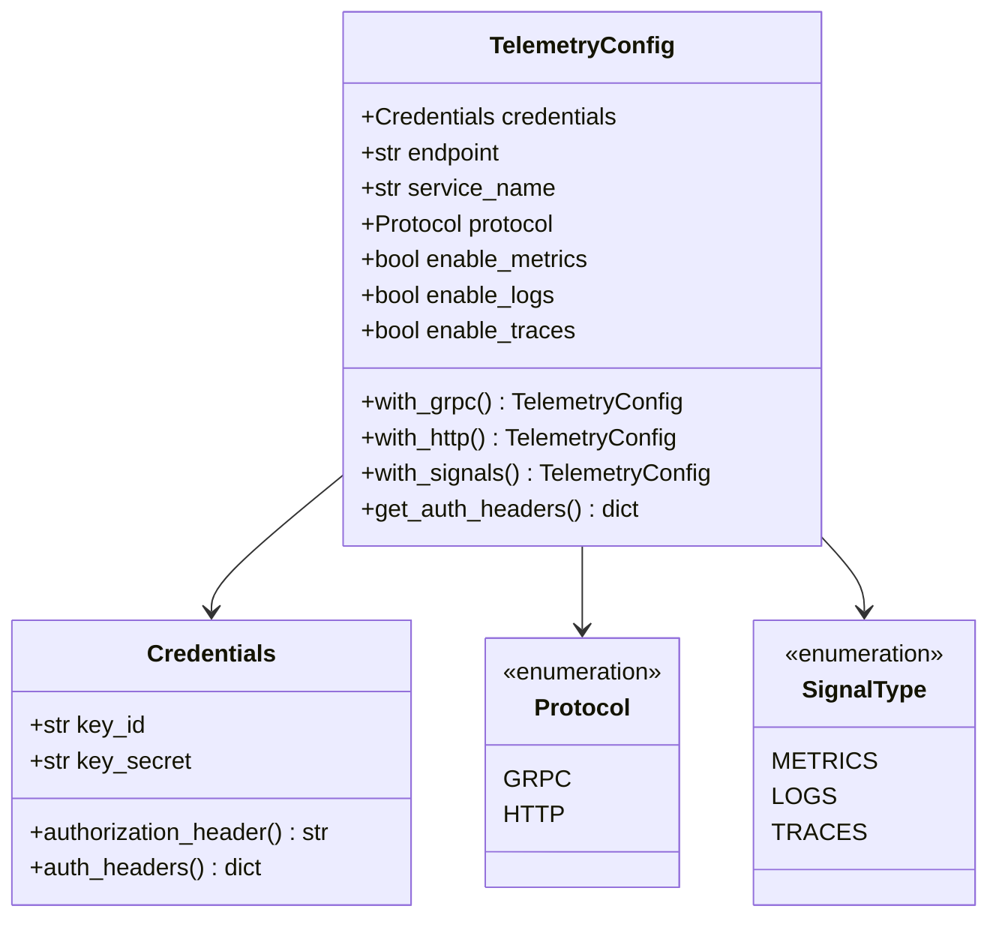

### Application Layer

**Location:** `src/telemetryflow/application/`

The application layer implements the CQRS pattern with commands and queries.

#### Commands

```mermaid
classDiagram
    class Command {
        <<abstract>>
        +datetime timestamp
    }

    class InitializeSDKCommand {
        +TelemetryConfig config
    }

    class ShutdownSDKCommand {
        +float timeout_seconds
    }

    class RecordMetricCommand {
        +str name
        +float value
        +str unit
        +dict attributes
    }

    class RecordCounterCommand {
        +str name
        +int value
        +dict attributes
    }

    class RecordGaugeCommand {
        +str name
        +float value
        +dict attributes
    }

    class RecordHistogramCommand {
        +str name
        +float value
        +str unit
        +dict attributes
    }

    class EmitLogCommand {
        +str message
        +SeverityLevel severity
        +dict attributes
    }

    class StartSpanCommand {
        +str name
        +SpanKind kind
        +dict attributes
    }

    class EndSpanCommand {
        +str span_id
        +Exception error
    }

    class AddSpanEventCommand {
        +str span_id
        +str name
        +dict attributes
    }

    Command <|-- InitializeSDKCommand
    Command <|-- ShutdownSDKCommand
    Command <|-- RecordMetricCommand
    Command <|-- RecordCounterCommand
    Command <|-- RecordGaugeCommand
    Command <|-- RecordHistogramCommand
    Command <|-- EmitLogCommand
    Command <|-- StartSpanCommand
    Command <|-- EndSpanCommand
    Command <|-- AddSpanEventCommand
```

#### Command Bus

```python
class CommandBus:
    """Dispatches commands to registered handlers."""

    def register(self, command_type: type[Command], handler: CommandHandler) -> None:
        """Register a handler for a command type."""

    def dispatch(self, command: Command) -> Any:
        """Dispatch command to handler."""
```

### Infrastructure Layer

**Location:** `src/telemetryflow/infrastructure/`

The infrastructure layer handles external integrations and OpenTelemetry SDK interaction.

#### OTLP Exporter Factory

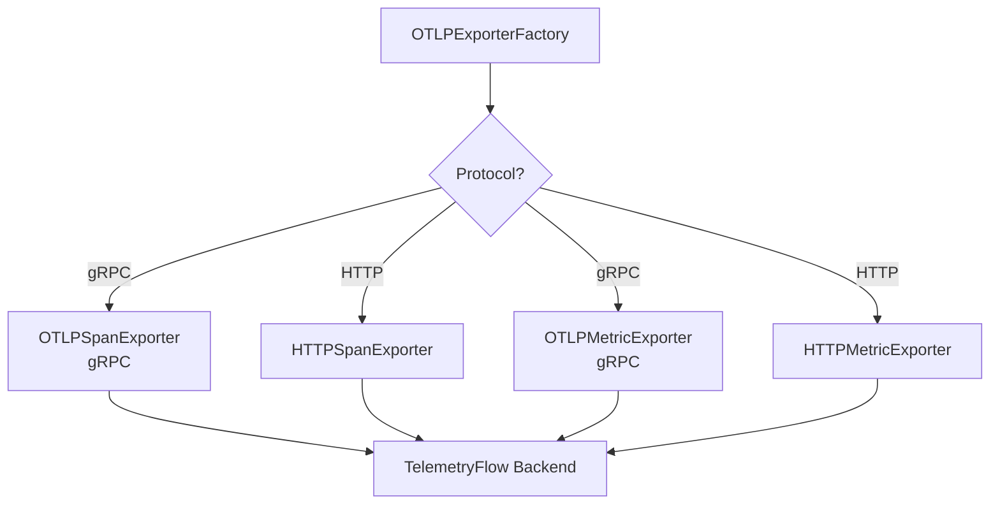

#### Command Handler

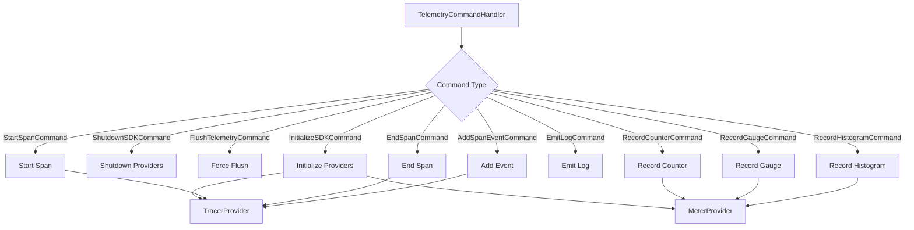

### Interface Layer

**Location:** `src/telemetryflow/client.py`, `src/telemetryflow/builder.py`

The interface layer provides the public API for SDK users.

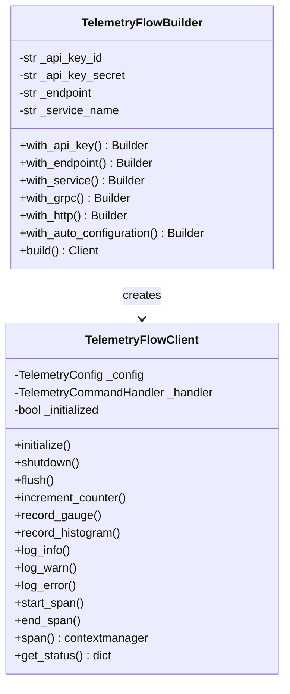

## CQRS Pattern

### Command Flow (Write Path)

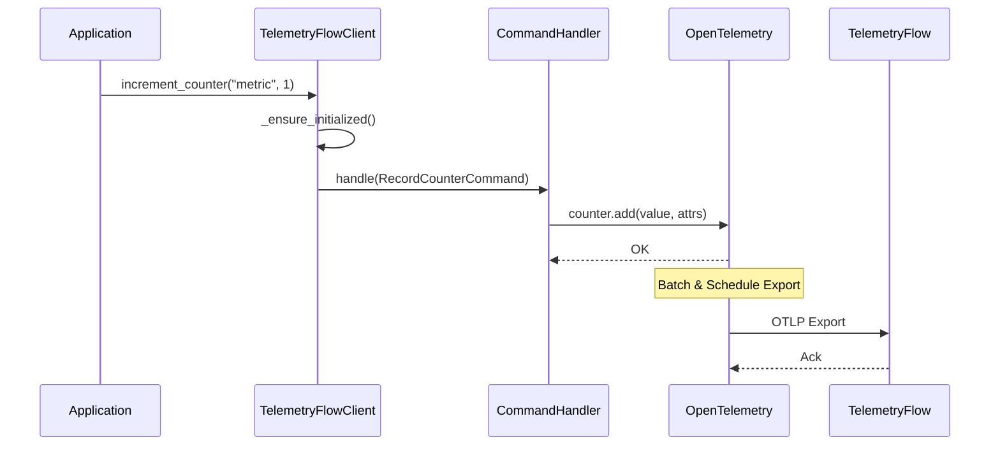

### Query Flow (Read Path)

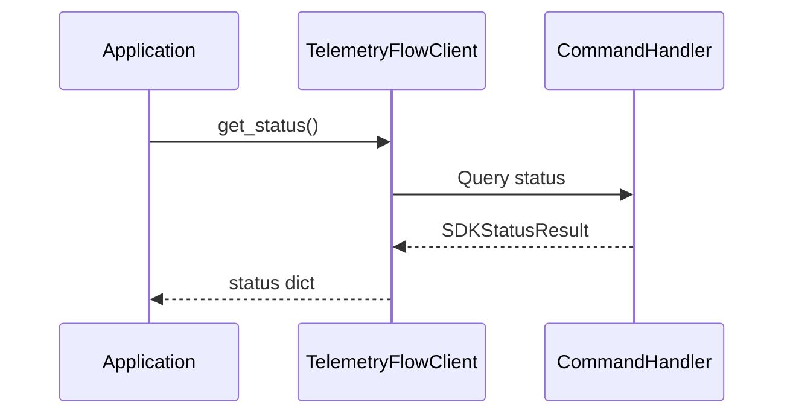

## Data Flow

### Metrics Data Flow

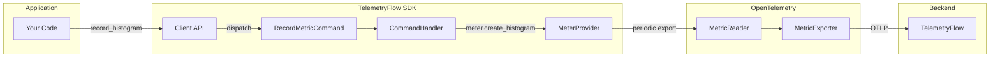

### Traces Data Flow

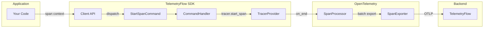

### Initialization Flow

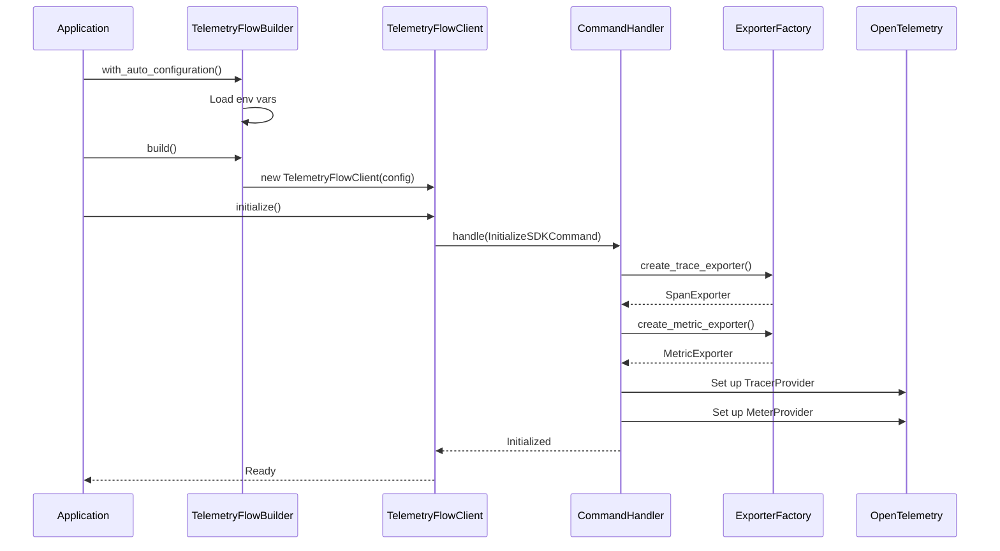

### Shutdown Flow

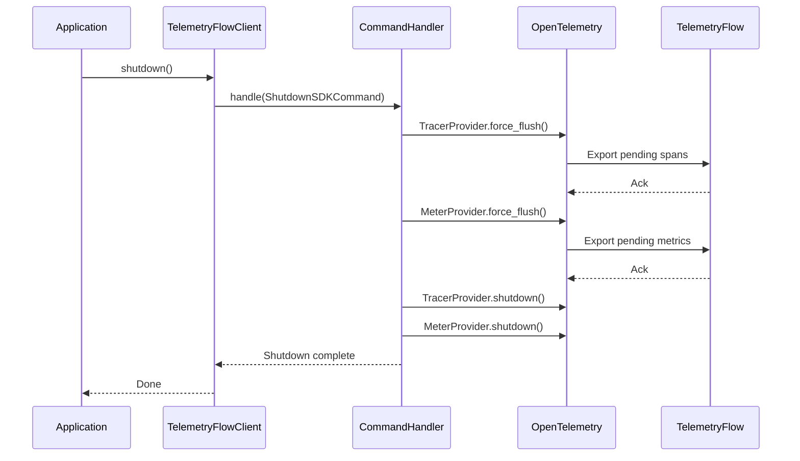

## Error Handling

### Error Hierarchy

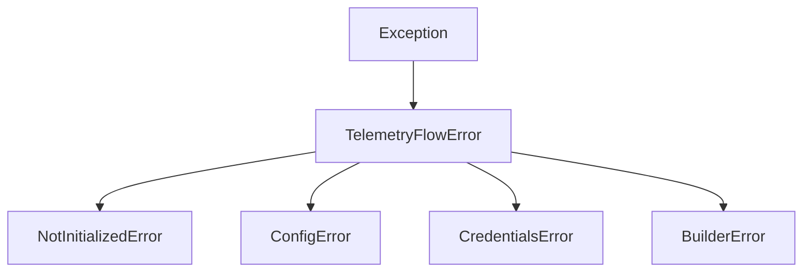

### Error Handling Flow

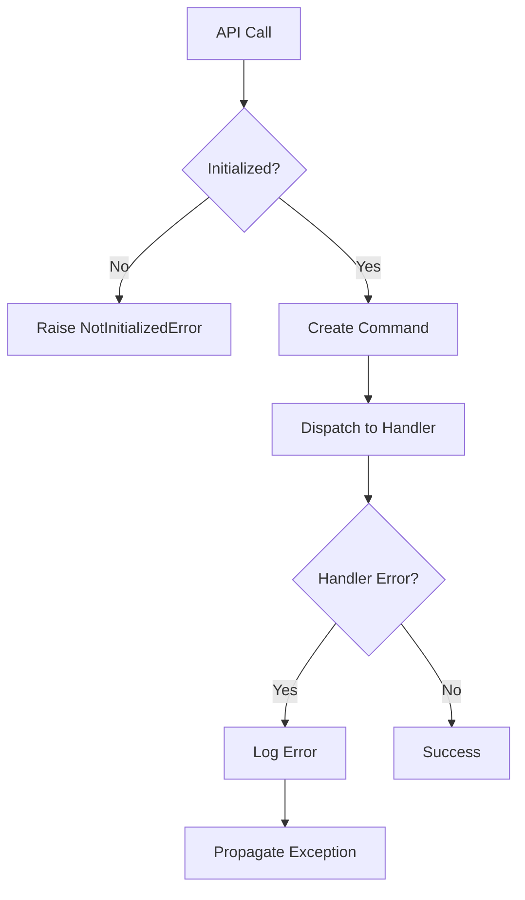

### Validation Points

| Layer | Validation | Error Type |
|-------|------------|------------|
| Domain | Credentials format | `CredentialsError` |
| Domain | Config completeness | `ConfigError` |
| Builder | Required fields | `BuilderError` |
| Client | Initialization state | `NotInitializedError` |
| Infrastructure | Export errors | Logged, may retry |

## Thread Safety

The SDK is designed to be thread-safe:

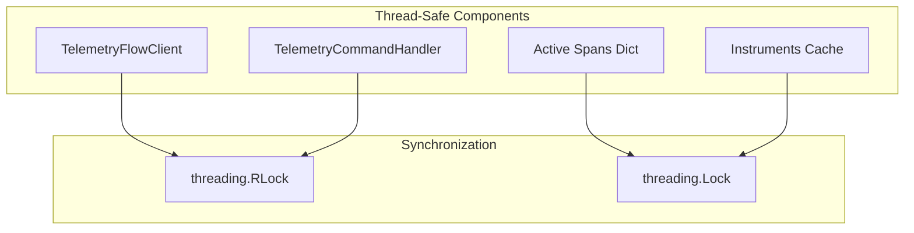

### Thread Safety Mechanisms

| Component | Mechanism | Protected Operations |
|-----------|-----------|---------------------|
| Client | `RLock` | initialize, shutdown |
| Handler | `RLock` | initialization state |
| Active Spans | `Lock` | span tracking dict |
| Instruments | `Lock` | metric instruments cache |

## Extension Points

### Custom Middleware

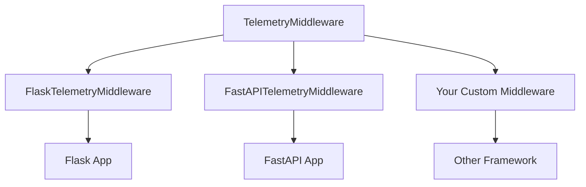

### Implementing Custom Middleware

```python
from telemetryflow.middleware.base import TelemetryMiddleware

class CustomMiddleware(TelemetryMiddleware):
    def __call__(self, request):
        span_id, start_time = self.start_request(
            method=request.method,
            path=request.path,
        )

        try:
            response = self.handle_request(request)
            status_code = response.status_code
        except Exception as e:
            status_code = 500
            raise
        finally:
            self.end_request(
                span_id, start_time,
                request.method, request.path,
                status_code
            )

        return response
```

## Performance Considerations

### Batching

```mermaid
mindmap
  root((Performance))
    Batching
      Span batching
      Metric aggregation
      Configurable intervals
    Async Export
      Background threads
      Non-blocking API
    Resource Pooling
      Connection reuse
      gRPC channels
    Memory
      Bounded queues
      Instrument caching
```

### Configuration Tuning

| Parameter | Default | Tuning Guide |
|-----------|---------|--------------|
| `batch_timeout` | 10s | Lower for real-time, higher for efficiency |
| `batch_max_size` | 512 | Higher for throughput, lower for latency |
| `timeout` | 30s | Based on network conditions |
| `compression` | true | Disable for low CPU environments |

## Best Practices

### 1. Initialize Once

```python
# Good: Single initialization
client = TelemetryFlowBuilder().with_auto_configuration().build()
client.initialize()

# Bad: Multiple initializations
for request in requests:
    client = TelemetryFlowBuilder()...  # Don't do this!
```

### 2. Use Context Managers for Spans

```python
# Good: Automatic cleanup
with client.span("operation") as span_id:
    # work...

# Avoid: Manual cleanup (error-prone)
span_id = client.start_span("operation")
# ... if exception occurs, span may not be ended
client.end_span(span_id)
```

### 3. Graceful Shutdown

```python
# Good: Ensure shutdown
try:
    client.initialize()
    # application logic
finally:
    client.shutdown()

# Better: Use context manager
with TelemetryFlowBuilder()...build() as client:
    # application logic
```

### 4. Meaningful Attributes

```python
# Good: Structured attributes
client.increment_counter(
    "http.requests",
    attributes={
        "http.method": "POST",
        "http.route": "/api/users",
        "http.status_code": 200,
    }
)

# Avoid: Unstructured or high-cardinality
client.increment_counter(
    "request",
    attributes={"url": request.full_url}  # High cardinality!
)
```

## Summary

The TelemetryFlow Python SDK architecture provides:

- **Clean Separation**: DDD layers isolate concerns
- **Flexibility**: CQRS allows independent scaling
- **Testability**: Each layer can be tested in isolation
- **Extensibility**: Easy to add new commands, exporters, or middleware
- **Thread Safety**: Safe for concurrent use
- **Performance**: Async export with batching
