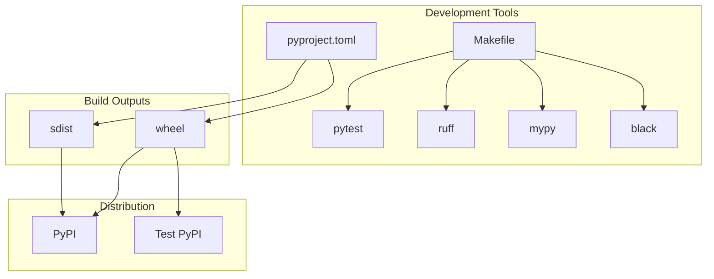
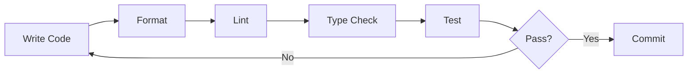
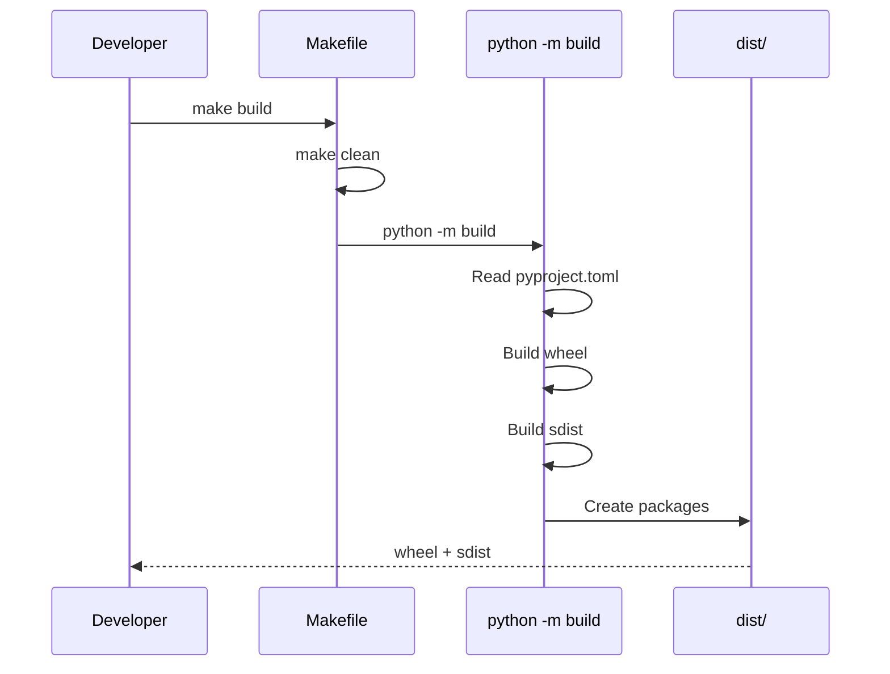
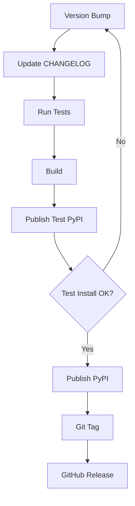

# Build System

This document describes the build system, development tools, and workflow for the TelemetryFlow Python SDK.

## Table of Contents

- [Overview](#overview)
- [Prerequisites](#prerequisites)
- [Project Structure](#project-structure)
- [Makefile Reference](#makefile-reference)
- [Development Workflow](#development-workflow)
- [Building](#building)
- [Publishing](#publishing)
- [Docker](#docker)

## Overview

The TelemetryFlow Python SDK uses a modern Python build system with:

- **pyproject.toml**: Project configuration (PEP 517/518)
- **setuptools**: Build backend
- **Makefile**: Development automation
- **pytest**: Testing framework
- **ruff**: Linting and formatting
- **mypy**: Type checking



## Prerequisites

### Python Version

Python 3.12 or higher is required:

```bash
python --version  # Should be 3.12+
```

### Development Dependencies

Install all development dependencies:

```bash
pip install -e ".[dev]"
```

Or with all optional dependencies:

```bash
pip install -e ".[dev,http,grpc]"
```

### Required Tools

| Tool | Purpose | Installation |
|------|---------|--------------|
| pip | Package installer | Built-in |
| pytest | Testing | `pip install pytest` |
| ruff | Linting/formatting | `pip install ruff` |
| mypy | Type checking | `pip install mypy` |
| black | Code formatting | `pip install black` |
| build | Package building | `pip install build` |
| twine | Package publishing | `pip install twine` |

## Project Structure

```
telemetryflow-python-sdk/
├── src/
│   └── telemetryflow/           # Main package
│       ├── __init__.py
│       ├── client.py
│       ├── builder.py
│       ├── version.py
│       ├── banner.py
│       ├── py.typed             # PEP 561 marker
│       ├── domain/
│       ├── application/
│       ├── infrastructure/
│       ├── middleware/
│       └── cli/
├── tests/                       # Test suite
│   ├── unit/
│   └── integration/
├── examples/                    # Example code
├── docs/                        # Documentation
├── pyproject.toml              # Project configuration
├── Makefile                    # Build automation
├── README.md
├── LICENSE
└── CHANGELOG.md
```

## Makefile Reference

### Help

```bash
make help
```

Displays all available targets:

```
TelemetryFlow Python SDK - Development Commands

Usage: make [target]

Setup:
  install        Install package in production mode
  install-dev    Install package in development mode with all extras
  venv           Create virtual environment

Testing:
  test           Run all tests
  test-unit      Run unit tests only
  test-integration Run integration tests only
  test-coverage  Run tests with coverage report
  test-fast      Run tests in parallel

Code Quality:
  lint           Run linting (ruff)
  format         Format code (black, isort)
  typecheck      Run type checking (mypy)
  check          Run all checks (lint, typecheck, test)

Build:
  build          Build distribution packages
  clean          Clean build artifacts
  publish        Publish to PyPI
  publish-test   Publish to Test PyPI

Development:
  run-example    Run basic example
  run-http       Run HTTP server example
  run-worker     Run worker example
  docs           Generate documentation
```

### Setup Targets

#### make venv

Create a virtual environment:

```bash
make venv
source venv/bin/activate
```

#### make install

Install the package in production mode:

```bash
make install
```

#### make install-dev

Install with all development dependencies:

```bash
make install-dev
```

### Testing Targets

#### make test

Run all tests:

```bash
make test
```

Equivalent to: `pytest`

#### make test-unit

Run only unit tests:

```bash
make test-unit
```

Equivalent to: `pytest tests/unit/ -v`

#### make test-integration

Run only integration tests:

```bash
make test-integration
```

Equivalent to: `pytest tests/integration/ -v -m integration`

#### make test-coverage

Run tests with coverage report:

```bash
make test-coverage
```

Equivalent to: `pytest --cov=telemetryflow --cov-report=html --cov-report=term-missing`

Opens coverage report at `htmlcov/index.html`

#### make test-fast

Run tests in parallel (requires pytest-xdist):

```bash
make test-fast
```

Equivalent to: `pytest -n auto`

### Code Quality Targets

#### make lint

Run linting with ruff:

```bash
make lint
```

Equivalent to: `ruff check src/ tests/`

#### make lint-fix

Run linting and auto-fix issues:

```bash
make lint-fix
```

Equivalent to: `ruff check src/ tests/ --fix`

#### make format

Format code with black and isort:

```bash
make format
```

Equivalent to:
```bash
black src/ tests/
isort src/ tests/
```

#### make format-check

Check formatting without modifying:

```bash
make format-check
```

#### make typecheck

Run type checking with mypy:

```bash
make typecheck
```

Equivalent to: `mypy src/`

#### make check

Run all checks (lint, typecheck, test):

```bash
make check
```

### Build Targets

#### make build

Build distribution packages:

```bash
make build
```

Creates:
- `dist/telemetryflow_sdk-1.1.1-py3-none-any.whl`
- `dist/telemetryflow_sdk-1.1.1.tar.gz`

#### make clean

Clean build artifacts:

```bash
make clean
```

Removes:
- `build/`
- `dist/`
- `*.egg-info/`
- `__pycache__/`
- `.pytest_cache/`
- `.mypy_cache/`
- `.coverage`

### Publishing Targets

#### make publish

Publish to PyPI:

```bash
make publish
```

**Requires:** PyPI credentials configured

#### make publish-test

Publish to Test PyPI:

```bash
make publish-test
```

**Requires:** Test PyPI credentials configured

### Development Targets

#### make run-example

Run the basic example:

```bash
make run-example
```

#### make run-http

Run the HTTP server example:

```bash
make run-http
```

#### make run-worker

Run the worker example:

```bash
make run-worker
```

#### make version

Display SDK version info:

```bash
make version
```

## Development Workflow

### Daily Development



### Recommended Workflow

```bash
# 1. Create feature branch
git checkout -b feature/my-feature

# 2. Make changes
# ... edit files ...

# 3. Format code
make format

# 4. Run checks
make check

# 5. Commit
git add .
git commit -m "Add my feature"

# 6. Push and create PR
git push origin feature/my-feature
```

### Pre-commit Hooks

Install pre-commit hooks:

```bash
pip install pre-commit
pre-commit install
```

Create `.pre-commit-config.yaml`:

```yaml
repos:
  - repo: https://github.com/astral-sh/ruff-pre-commit
    rev: v0.6.0
    hooks:
      - id: ruff
        args: [--fix]
      - id: ruff-format

  - repo: https://github.com/pre-commit/mirrors-mypy
    rev: v1.11.0
    hooks:
      - id: mypy
        additional_dependencies: [types-all]
```

## Building

### Build Process



### Building Locally

```bash
# Clean and build
make build

# Verify build
ls -la dist/
```

### Build Output

```
dist/
├── telemetryflow_sdk-1.1.1-py3-none-any.whl  # Wheel (binary)
└── telemetryflow_sdk-1.1.1.tar.gz            # Source distribution
```

### Installing Built Package

```bash
# Install wheel
pip install dist/telemetryflow_sdk-1.1.1-py3-none-any.whl

# Install from source
pip install dist/telemetryflow_sdk-1.1.1.tar.gz
```

## Publishing

### PyPI Setup

1. Create account at https://pypi.org
2. Create API token
3. Configure credentials:

```bash
# Create ~/.pypirc
cat > ~/.pypirc << EOF
[pypi]
username = __token__
password = pypi-your-token-here

[testpypi]
repository = https://test.pypi.org/legacy/
username = __token__
password = pypi-your-test-token-here
EOF
```

### Publishing Flow



### Publishing Commands

```bash
# 1. Update version in pyproject.toml
# version = "1.2.0"

# 2. Update CHANGELOG.md

# 3. Run full check
make check

# 4. Build
make build

# 5. Publish to Test PyPI first
make publish-test

# 6. Test installation
pip install --index-url https://test.pypi.org/simple/ telemetryflow-sdk

# 7. Publish to production PyPI
make publish

# 8. Tag release
git tag v1.2.0
git push origin v1.2.0
```

## Docker

### Development Container

Create `Dockerfile.dev`:

```dockerfile
FROM python:3.12-slim

WORKDIR /app

# Install development tools
RUN pip install --no-cache-dir \
    pytest \
    pytest-cov \
    ruff \
    mypy \
    black \
    isort

# Copy source
COPY . .

# Install package
RUN pip install -e ".[dev]"

CMD ["pytest"]
```

Build and run:

```bash
docker build -f Dockerfile.dev -t telemetryflow-dev .
docker run -it --rm telemetryflow-dev
```

### Production Container

Create `Dockerfile`:

```dockerfile
FROM python:3.12-slim

WORKDIR /app

COPY dist/telemetryflow_sdk-*.whl .

RUN pip install --no-cache-dir telemetryflow_sdk-*.whl

# Example application
COPY examples/basic/main.py .

CMD ["python", "main.py"]
```

### Docker Compose

```yaml
version: "3.8"

services:
  sdk:
    build:
      context: .
      dockerfile: Dockerfile.dev
    volumes:
      - .:/app
    environment:
      - TELEMETRYFLOW_API_KEY_ID
      - TELEMETRYFLOW_API_KEY_SECRET
      - TELEMETRYFLOW_SERVICE_NAME=docker-test
      - TELEMETRYFLOW_ENDPOINT=otel-collector:4317

  otel-collector:
    image: otel/opentelemetry-collector:latest
    ports:
      - "4317:4317"
      - "4318:4318"
```

## Tool Configuration

### pyproject.toml

Key sections:

```toml
[build-system]
requires = ["setuptools>=61.0", "wheel"]
build-backend = "setuptools.build_meta"

[project]
name = "telemetryflow-sdk"
version = "1.1.1"
requires-python = ">=3.12"

[tool.pytest.ini_options]
testpaths = ["tests"]
addopts = ["-v", "--strict-markers"]

[tool.coverage.run]
source = ["src/telemetryflow"]
fail_under = 80

[tool.mypy]
python_version = "3.12"
strict = true

[tool.ruff]
target-version = "py312"
line-length = 100

[tool.black]
target-version = ["py312", "py313"]
line-length = 100
```

## CI/CD

### GitHub Actions

Create `.github/workflows/ci.yml`:

```yaml
name: CI

on:
  push:
    branches: [main]
  pull_request:
    branches: [main]

jobs:
  test:
    runs-on: ubuntu-latest
    strategy:
      matrix:
        python-version: ["3.12", "3.13"]

    steps:
      - uses: actions/checkout@v4

      - name: Set up Python
        uses: actions/setup-python@v5
        with:
          python-version: ${{ matrix.python-version }}

      - name: Install dependencies
        run: pip install -e ".[dev]"

      - name: Lint
        run: make lint

      - name: Type check
        run: make typecheck

      - name: Test
        run: make test-coverage

  build:
    runs-on: ubuntu-latest
    needs: test

    steps:
      - uses: actions/checkout@v4

      - name: Set up Python
        uses: actions/setup-python@v5
        with:
          python-version: "3.12"

      - name: Build
        run: |
          pip install build
          make build

      - name: Upload artifacts
        uses: actions/upload-artifact@v4
        with:
          name: dist
          path: dist/
```

## Related Documentation

- [Testing Guide](TESTING.md) - Testing best practices
- [Architecture Guide](ARCHITECTURE.md) - Project architecture
- [API Reference](API_REFERENCE.md) - API documentation
