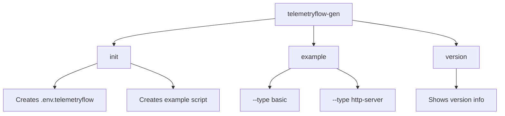
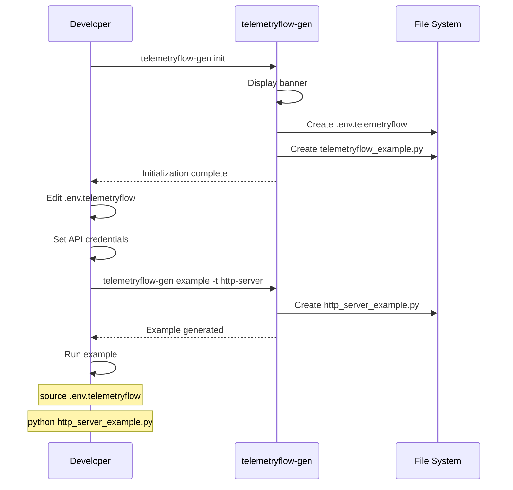

# TelemetryFlow Generator

The `telemetryflow-gen` CLI tool helps you quickly set up TelemetryFlow SDK integration in your Python projects.

## Installation

The generator is installed automatically with the SDK:

```bash
pip install telemetryflow-python-sdk
```

Verify installation:

```bash
telemetryflow-gen --version
```

## Commands



### Overview

| Command | Description |
|---------|-------------|
| `init` | Initialize TelemetryFlow in your project |
| `example` | Generate example code |
| `version` | Show version information |

## Command: init

Initialize TelemetryFlow SDK integration in your project.

### Usage

```bash
telemetryflow-gen init [options]
```

### Options

| Option | Short | Default | Description |
|--------|-------|---------|-------------|
| `--output` | `-o` | `.` | Output directory |
| `--force` | `-f` | `false` | Overwrite existing files |

### Output Files

| File | Description |
|------|-------------|
| `.env.telemetryflow` | Environment configuration template |
| `telemetryflow_example.py` | Basic usage example |

### Example

```bash
# Initialize in current directory
telemetryflow-gen init

# Initialize in specific directory
telemetryflow-gen init -o ./src

# Force overwrite existing files
telemetryflow-gen init --force
```

### Generated Environment File

```bash
# .env.telemetryflow

# Required: API Key credentials
TELEMETRYFLOW_API_KEY_ID=tfk_your_key_id
TELEMETRYFLOW_API_KEY_SECRET=tfs_your_key_secret

# Required: Service configuration
TELEMETRYFLOW_SERVICE_NAME=my-service
TELEMETRYFLOW_SERVICE_VERSION=1.0.0

# Optional: Endpoint (default: api.telemetryflow.id:4317)
TELEMETRYFLOW_ENDPOINT=api.telemetryflow.id:4317

# Optional: Environment (default: production)
TELEMETRYFLOW_ENVIRONMENT=development

# Optional: Service namespace
TELEMETRYFLOW_SERVICE_NAMESPACE=telemetryflow
```

### Generated Example Script

```python
# telemetryflow_example.py

from telemetryflow import TelemetryFlowBuilder
from telemetryflow.application.commands import SpanKind


def main():
    client = TelemetryFlowBuilder().with_auto_configuration().build()
    client.initialize()

    try:
        # Record metrics
        client.increment_counter("app.requests.total")
        client.record_gauge("app.active_connections", 42)

        # Emit logs
        client.log_info("Application started")

        # Create traces
        with client.span("process_request", SpanKind.SERVER) as span_id:
            client.add_span_event(span_id, "checkpoint_reached")

    finally:
        client.shutdown()


if __name__ == "__main__":
    main()
```

## Command: example

Generate example code for different use cases.

### Usage

```bash
telemetryflow-gen example [options]
```

### Options

| Option | Short | Default | Description |
|--------|-------|---------|-------------|
| `--type` | `-t` | `basic` | Example type |
| `--output` | `-o` | `.` | Output directory |
| `--force` | `-f` | `false` | Overwrite existing files |

### Example Types

| Type | Description | Output File |
|------|-------------|-------------|
| `basic` | Basic SDK usage | `basic_example.py` |
| `http-server` | HTTP server with instrumentation | `http_server_example.py` |

### Example

```bash
# Generate basic example
telemetryflow-gen example

# Generate HTTP server example
telemetryflow-gen example --type http-server

# Generate to specific directory
telemetryflow-gen example -t http-server -o ./examples
```

### Basic Example Template

The basic example demonstrates:
- Client initialization and shutdown
- Recording metrics (counter, gauge, histogram)
- Emitting logs (info, warn, error, debug)
- Creating trace spans with events
- Nested spans using context manager
- Getting SDK status

### HTTP Server Example Template

The HTTP server example demonstrates:
- Full request instrumentation
- Automatic span creation for requests
- Request duration histogram
- Request counter metrics
- Error counting and logging
- Nested spans for database/cache operations
- Multiple endpoints with different behaviors

## Command: version

Display version information.

### Usage

```bash
telemetryflow-gen version
```

### Output

```
TelemetryFlow Python SDK v1.1.1
Git Commit: abc1234
Git Branch: main
Build Time: 2024-12-30T00:00:00Z
Python: 3.12.11
Platform: darwin/arm64
```

## Workflow



## Integration with Existing Projects

### Step 1: Initialize

```bash
cd your-project
telemetryflow-gen init
```

### Step 2: Configure

Edit `.env.telemetryflow` with your credentials:

```bash
TELEMETRYFLOW_API_KEY_ID=tfk_your_actual_key
TELEMETRYFLOW_API_KEY_SECRET=tfs_your_actual_secret
TELEMETRYFLOW_SERVICE_NAME=your-service-name
```

### Step 3: Load Environment

Option A: Source the file:
```bash
source .env.telemetryflow
```

Option B: Use python-dotenv:
```python
from dotenv import load_dotenv
load_dotenv('.env.telemetryflow')
```

### Step 4: Add to Your Code

```python
from telemetryflow import TelemetryFlowBuilder

# In your application startup
client = TelemetryFlowBuilder().with_auto_configuration().build()
client.initialize()

# In your application shutdown
client.shutdown()
```

## Best Practices

### 1. Separate Environment Files

Keep different configurations for each environment:

```
.env.telemetryflow.development
.env.telemetryflow.staging
.env.telemetryflow.production
```

### 2. Don't Commit Secrets

Add to `.gitignore`:

```gitignore
.env.telemetryflow
.env.telemetryflow.*
*.local
```

### 3. Use Service Namespaces

Organize services by namespace:

```bash
TELEMETRYFLOW_SERVICE_NAMESPACE=platform
TELEMETRYFLOW_SERVICE_NAME=api-gateway
```

### 4. Version Your Services

Track deployments with versions:

```bash
TELEMETRYFLOW_SERVICE_VERSION=1.2.3
```

## Troubleshooting

### Generator Not Found

```
command not found: telemetryflow-gen
```

**Solution:** Reinstall the SDK or check your PATH:

```bash
pip install --force-reinstall telemetryflow-python-sdk
# or
python -m telemetryflow.cli.generator init
```

### Permission Denied

```
PermissionError: [Errno 13] Permission denied
```

**Solution:** Check directory permissions or use sudo (not recommended):

```bash
chmod 755 ./output-directory
telemetryflow-gen init -o ./output-directory
```

### File Already Exists

```
Error: .env.telemetryflow already exists. Use --force to overwrite.
```

**Solution:** Use the `--force` flag or backup existing files:

```bash
mv .env.telemetryflow .env.telemetryflow.backup
telemetryflow-gen init
```

## API Reference

### Module: telemetryflow.cli.generator

```python
def main(argv: list[str] | None = None) -> int:
    """Main entry point for the CLI."""
    ...
```

### Exit Codes

| Code | Description |
|------|-------------|
| 0 | Success |
| 1 | Error (file exists, invalid option, etc.) |

## Related Documentation

- [Quick Start Guide](QUICKSTART.md)
- [API Reference](API_REFERENCE.md)
- [Examples](../examples/)
