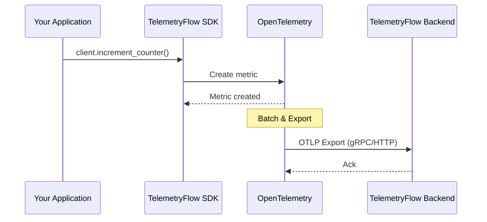

# Quick Start Guide

Get started with TelemetryFlow Python SDK in 5 minutes.

## Prerequisites

- Python 3.9 or higher
- pip package manager
- TelemetryFlow API credentials (get them at https://app.telemetryflow.id)

## Installation

```bash
pip install telemetryflow-python-sdk
```

Or install from source:

```bash
git clone https://github.com/telemetryflow/telemetryflow-python-sdk.git
cd telemetryflow-python-sdk
pip install -e .
```

## Configuration

### Option 1: Environment Variables (Recommended)

Create a `.env` file or set environment variables:

```bash
export TELEMETRYFLOW_API_KEY_ID=tfk_your_key_id
export TELEMETRYFLOW_API_KEY_SECRET=tfs_your_key_secret
export TELEMETRYFLOW_ENDPOINT=api.telemetryflow.id:4317
export TELEMETRYFLOW_SERVICE_NAME=my-python-service
export TELEMETRYFLOW_SERVICE_VERSION=1.0.0
export TELEMETRYFLOW_ENVIRONMENT=production
```

Then use auto-configuration:

```python
from telemetryflow import TelemetryFlowBuilder

client = TelemetryFlowBuilder().with_auto_configuration().build()
```

### Option 2: Manual Configuration

```python
from telemetryflow import TelemetryFlowBuilder

client = (
    TelemetryFlowBuilder()
    .with_api_key("tfk_your_key_id", "tfs_your_key_secret")
    .with_endpoint("api.telemetryflow.id:4317")
    .with_service("my-python-service", "1.0.0")
    .with_environment("production")
    .build()
)
```

## Basic Usage

### Complete Example

```python
from telemetryflow import TelemetryFlowBuilder
from telemetryflow.application.commands import SpanKind

def main():
    # Create and initialize client
    client = TelemetryFlowBuilder().with_auto_configuration().build()
    client.initialize()

    try:
        # Record metrics
        client.increment_counter("app.requests.total")
        client.record_gauge("app.active_users", 42)
        client.record_histogram("app.response_time", 0.125, unit="s")

        # Emit logs
        client.log_info("Application started", {"version": "1.0.0"})

        # Create traces
        with client.span("process_request", SpanKind.SERVER) as span_id:
            client.add_span_event(span_id, "processing_started")
            # ... do work ...
            client.add_span_event(span_id, "processing_completed")

    finally:
        client.shutdown()

if __name__ == "__main__":
    main()
```

### Using Context Manager

```python
from telemetryflow import TelemetryFlowBuilder

with TelemetryFlowBuilder().with_auto_configuration().build() as client:
    client.increment_counter("app.started")
    client.log_info("Application running")
    # Client automatically initializes and shuts down
```

## Quick Reference

### Metrics

```python
# Counter - increment by 1
client.increment_counter("requests.total")

# Counter - increment by N with attributes
client.increment_counter("requests.total", value=5, attributes={"endpoint": "/api"})

# Gauge - current value
client.record_gauge("connections.active", 42)

# Histogram - distribution
client.record_histogram("request.duration", 0.125, unit="s")
```

### Logs

```python
# Log levels
client.log_debug("Debug message")
client.log_info("Info message")
client.log_warn("Warning message")
client.log_error("Error message")

# With attributes
client.log_info("User logged in", {"user_id": "123", "ip": "192.168.1.1"})
```

### Traces

```python
from telemetryflow.application.commands import SpanKind

# Using context manager (recommended)
with client.span("operation_name", SpanKind.SERVER) as span_id:
    client.add_span_event(span_id, "checkpoint")
    # ... do work ...

# Manual span management
span_id = client.start_span("operation_name", SpanKind.CLIENT)
try:
    client.add_span_event(span_id, "started")
    # ... do work ...
except Exception as e:
    client.end_span(span_id, error=e)
    raise
else:
    client.end_span(span_id)
```

## Span Kinds

| Kind | Use Case |
|------|----------|
| `SpanKind.INTERNAL` | Internal operations (default) |
| `SpanKind.SERVER` | Server-side request handling |
| `SpanKind.CLIENT` | Client-side requests |
| `SpanKind.PRODUCER` | Message queue producers |
| `SpanKind.CONSUMER` | Message queue consumers |

## Data Flow



## Next Steps

1. Read the [Architecture Guide](ARCHITECTURE.md) to understand the SDK design
2. Check the [API Reference](API_REFERENCE.md) for complete method documentation
3. Explore [Examples](../examples/) for real-world usage patterns
4. Use the [Generator](GENERATOR.md) to scaffold new projects

## Common Issues

### Connection Refused

```
Error: Failed to connect to api.telemetryflow.id:4317
```

**Solutions:**
1. Check your network connectivity
2. Verify the endpoint is correct
3. Try using HTTP protocol: `.with_http()`

### Invalid Credentials

```
Error: API key ID must start with 'tfk_'
```

**Solutions:**
1. Verify your API key format
2. Ensure environment variables are set correctly
3. Check for trailing whitespace in credentials

### Client Not Initialized

```
NotInitializedError: Client is not initialized. Call initialize() first.
```

**Solutions:**
1. Call `client.initialize()` before using the client
2. Use the context manager pattern: `with ... as client:`
