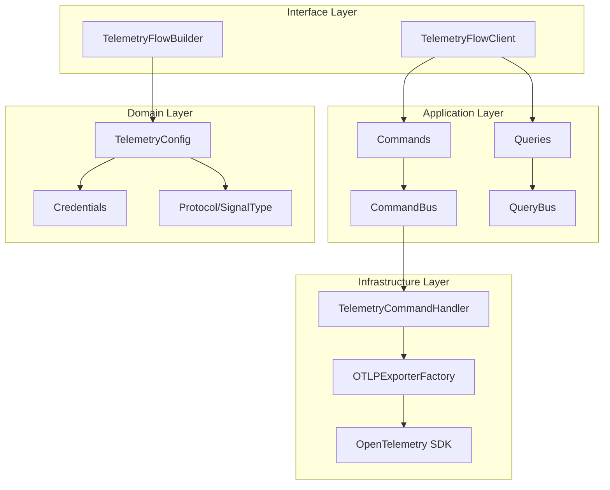

# TelemetryFlow Python SDK Documentation

Welcome to the TelemetryFlow Python SDK documentation. This SDK provides a simple and powerful interface for instrumenting your Python applications with metrics, logs, and traces using OpenTelemetry.

## Documentation Index

| Document | Description |
|----------|-------------|
| [Quick Start](QUICKSTART.md) | Get started in 5 minutes |
| [Architecture](ARCHITECTURE.md) | DDD/CQRS architecture with diagrams |
| [API Reference](API_REFERENCE.md) | Complete API documentation |
| [Generator](GENERATOR.md) | CLI generator tool |
| [Testing](TESTING.md) | Testing guide and best practices |
| [Build System](BUILD-SYSTEM.md) | Build system and development |

## Quick Links

- [Main README](../README.md) - Project overview and examples
- [Examples](../examples/) - Working code examples
- [Changelog](../CHANGELOG.md) - Version history

## Architecture Overview

## SDK Features

### Core Features
- **100% OTLP Compliant**: Full OpenTelemetry Protocol support
- **Three Signals**: Metrics, Logs, and Traces
- **Multiple Protocols**: gRPC (default) and HTTP
- **Type Safety**: Full type hints with mypy support

### Architecture
- **Domain-Driven Design (DDD)**: Clean separation of concerns
- **CQRS Pattern**: Command Query Responsibility Segregation
- **Builder Pattern**: Fluent configuration API
- **Immutable Value Objects**: Thread-safe credentials

### Integrations
- **Flask Middleware**: Automatic HTTP instrumentation
- **FastAPI Middleware**: ASGI middleware support
- **CLI Generator**: Project scaffolding tool

## Supported Python Versions

| Version | Status |
|---------|--------|
| Python 3.9 | ✅ Supported |
| Python 3.10 | ✅ Supported |
| Python 3.11 | ✅ Supported |
| Python 3.12 | ✅ Supported |
| Python 3.13 | ✅ Supported |

## Dependencies

### Core Dependencies
| Package | Version | Purpose |
|---------|---------|---------|
| opentelemetry-api | ≥1.28.0 | Core telemetry API |
| opentelemetry-sdk | ≥1.28.0 | SDK implementation |
| opentelemetry-exporter-otlp-proto-grpc | ≥1.28.0 | gRPC exporter |
| opentelemetry-exporter-otlp-proto-http | ≥1.28.0 | HTTP exporter |

### Optional Dependencies
| Package | Group | Purpose |
|---------|-------|---------|
| flask | http | Flask middleware |
| fastapi | http | FastAPI middleware |
| grpcio | grpc | gRPC support |
| pytest | dev | Testing framework |
| mypy | dev | Type checking |
| ruff | dev | Linting |

## Getting Help

- **Documentation**: https://docs.telemetryflow.id
- **GitHub Issues**: https://github.com/telemetryflow/telemetryflow-python-sdk/issues
- **Website**: https://telemetryflow.id

## License

Apache License 2.0 - See [LICENSE](../LICENSE) for details.
