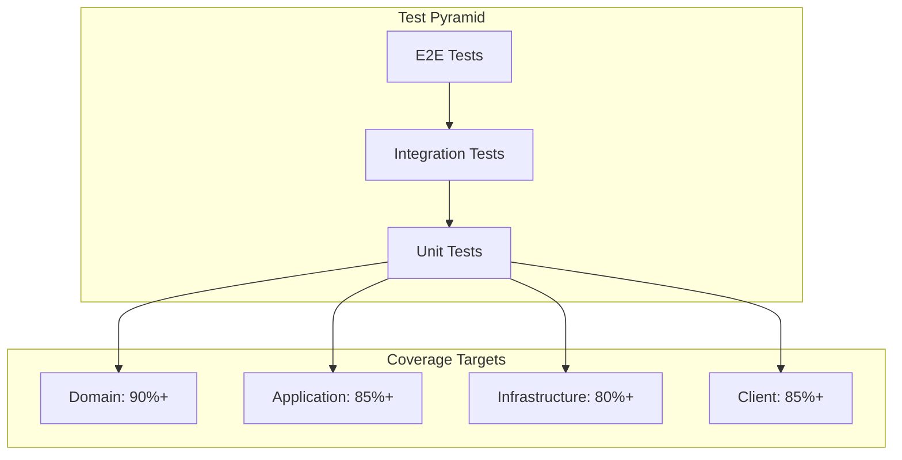
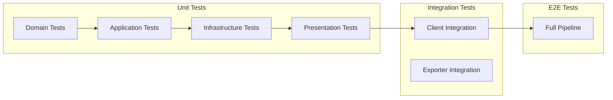
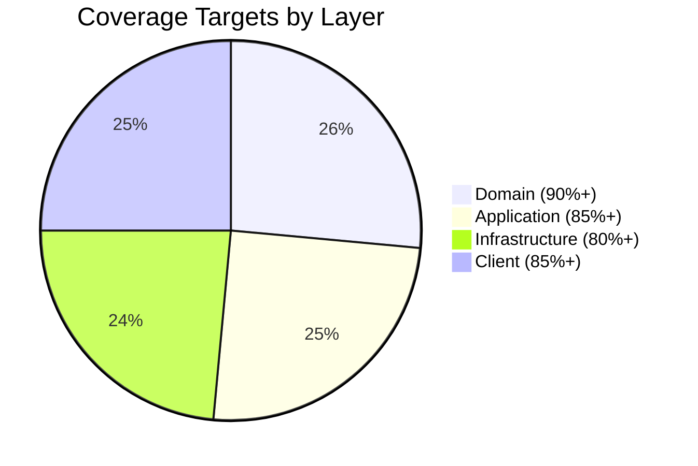

# Testing Guide

This document describes the testing strategy, structure, and best practices for the TelemetryFlow Python SDK.

## Table of Contents

- [Overview](#overview)
- [Test Structure](#test-structure)
- [Running Tests](#running-tests)
- [Test Categories](#test-categories)
- [Writing Tests](#writing-tests)
- [Coverage](#coverage)
- [CI/CD Integration](#cicd-integration)

## Overview

The TelemetryFlow Python SDK uses a comprehensive testing strategy organized by DDD layers:



## Test Structure

### Directory Layout

```
tests/
├── __init__.py
├── unit/                           # Unit tests by DDD layer
│   ├── __init__.py
│   ├── domain/                     # Domain layer tests
│   │   ├── __init__.py
│   │   ├── test_credentials.py
│   │   └── test_config.py
│   ├── application/                # Application layer tests
│   │   ├── __init__.py
│   │   └── test_commands.py
│   ├── infrastructure/             # Infrastructure layer tests
│   │   └── __init__.py
│   └── presentation/               # Interface layer tests
│       ├── __init__.py
│       ├── test_client.py
│       ├── test_builder.py
│       ├── test_banner.py
│       └── test_version.py
├── integration/                    # Integration tests
│   ├── __init__.py
│   └── test_client_integration.py
└── mocks/                          # Mock implementations
    └── __init__.py
```

### Layer-Based Organization



## Running Tests

### Prerequisites

Install development dependencies:

```bash
pip install -e ".[dev]"
```

### Basic Commands

```bash
# Run all tests
pytest

# Run with verbose output
pytest -v

# Run specific test file
pytest tests/unit/domain/test_credentials.py

# Run specific test class
pytest tests/unit/domain/test_credentials.py::TestCredentials

# Run specific test method
pytest tests/unit/domain/test_credentials.py::TestCredentials::test_create_valid_credentials
```

### Using Make

```bash
# Run all tests
make test

# Run unit tests only
make test-unit

# Run integration tests
make test-integration

# Run with coverage
make test-coverage
```

### Test Markers

```bash
# Run only unit tests
pytest -m unit

# Run only integration tests
pytest -m integration

# Skip slow tests
pytest -m "not slow"

# Run only fast tests
pytest -m "not slow and not integration"
```

## Test Categories

### Unit Tests

Unit tests verify individual components in isolation.

#### Domain Layer Tests

**File:** `tests/unit/domain/test_credentials.py`

```python
class TestCredentials:
    """Test suite for Credentials value object."""

    def test_create_valid_credentials(self) -> None:
        """Test creating valid credentials."""
        creds = Credentials.create("tfk_test_key", "tfs_test_secret")
        assert creds.key_id == "tfk_test_key"

    def test_invalid_key_id_prefix(self) -> None:
        """Test that invalid key ID prefix raises error."""
        with pytest.raises(CredentialsError):
            Credentials.create("invalid_key", "tfs_secret")

    def test_authorization_header(self) -> None:
        """Test authorization header format."""
        creds = Credentials.create("tfk_key", "tfs_secret")
        assert creds.authorization_header() == "Bearer tfk_key:tfs_secret"
```

**File:** `tests/unit/domain/test_config.py`

```python
class TestTelemetryConfig:
    """Test suite for TelemetryConfig."""

    def test_default_values(self, valid_credentials: Credentials) -> None:
        """Test default configuration values."""
        config = TelemetryConfig(
            credentials=valid_credentials,
            endpoint="localhost:4317",
            service_name="test-service",
        )
        assert config.protocol == Protocol.GRPC
        assert config.enable_metrics is True
```

#### Application Layer Tests

**File:** `tests/unit/application/test_commands.py`

```python
class TestRecordCounterCommand:
    """Test suite for RecordCounterCommand."""

    def test_create_command(self) -> None:
        """Test creating command."""
        cmd = RecordCounterCommand(name="test.counter", value=5)
        assert cmd.name == "test.counter"
        assert cmd.value == 5

    def test_default_value(self) -> None:
        """Test default increment value."""
        cmd = RecordCounterCommand(name="test.counter")
        assert cmd.value == 1
```

#### Presentation Layer Tests

**File:** `tests/unit/presentation/test_client.py`

```python
class TestTelemetryFlowClient:
    """Test suite for TelemetryFlowClient."""

    def test_not_initialized_error(self, client: TelemetryFlowClient) -> None:
        """Test operations fail when not initialized."""
        with pytest.raises(NotInitializedError):
            client.increment_counter("test.counter")

    def test_context_manager(self, valid_config: TelemetryConfig) -> None:
        """Test client as context manager."""
        with TelemetryFlowClient(valid_config) as client:
            assert client.is_initialized()
        assert not client.is_initialized()
```

### Integration Tests

Integration tests verify cross-layer interactions.

**File:** `tests/integration/test_client_integration.py`

```python
@pytest.mark.integration
class TestClientIntegration:
    """Integration tests for TelemetryFlow client."""

    def test_client_lifecycle(self) -> None:
        """Test full client lifecycle."""
        client = (
            TelemetryFlowBuilder()
            .with_api_key("tfk_test", "tfs_test")
            .with_endpoint("localhost:4317")
            .with_service("test-service")
            .with_insecure(True)
            .build()
        )

        assert not client.is_initialized()
        client.initialize()
        assert client.is_initialized()
        client.shutdown()
        assert not client.is_initialized()

    def test_metrics_recording(self, client) -> None:
        """Test recording various metrics."""
        client.increment_counter("test.counter", 5)
        client.record_gauge("test.gauge", 42.5)
        client.record_histogram("test.histogram", 0.125, unit="s")

        status = client.get_status()
        assert status["metrics_sent"] > 0
```

## Writing Tests

### Test Fixtures

Use pytest fixtures for common setup:

```python
import pytest
from telemetryflow.domain.credentials import Credentials
from telemetryflow.domain.config import TelemetryConfig


@pytest.fixture
def valid_credentials() -> Credentials:
    """Create valid credentials for testing."""
    return Credentials.create("tfk_test_key", "tfs_test_secret")


@pytest.fixture
def valid_config(valid_credentials: Credentials) -> TelemetryConfig:
    """Create valid config for testing."""
    return TelemetryConfig(
        credentials=valid_credentials,
        endpoint="localhost:4317",
        service_name="test-service",
    )


@pytest.fixture
def client(valid_config: TelemetryConfig) -> TelemetryFlowClient:
    """Create and initialize client for testing."""
    client = TelemetryFlowClient(valid_config)
    client.initialize()
    yield client
    client.shutdown()
```

### Test Naming Convention

```python
def test_<method>_<scenario>_<expected_result>(self) -> None:
    """Test <method> when <scenario> should <expected_result>."""
    ...

# Examples:
def test_create_valid_credentials(self) -> None:
    """Test creating valid credentials."""

def test_increment_counter_not_initialized_raises_error(self) -> None:
    """Test increment_counter when not initialized should raise error."""

def test_shutdown_timeout_expires_gracefully(self) -> None:
    """Test shutdown when timeout expires should complete gracefully."""
```

### Testing Patterns

#### Table-Driven Tests

```python
@pytest.mark.parametrize(
    "key_id,key_secret,should_raise",
    [
        ("tfk_valid", "tfs_valid", False),
        ("", "tfs_valid", True),
        ("tfk_valid", "", True),
        ("invalid", "tfs_valid", True),
        ("tfk_valid", "invalid", True),
    ],
)
def test_credentials_validation(
    self,
    key_id: str,
    key_secret: str,
    should_raise: bool,
) -> None:
    """Test credentials validation with various inputs."""
    if should_raise:
        with pytest.raises(CredentialsError):
            Credentials.create(key_id, key_secret)
    else:
        creds = Credentials.create(key_id, key_secret)
        assert creds.key_id == key_id
```

#### Mocking External Dependencies

```python
from unittest import mock

def test_with_api_key_from_env(self) -> None:
    """Test loading API key from environment."""
    with mock.patch.dict(
        os.environ,
        {
            "TELEMETRYFLOW_API_KEY_ID": "tfk_env_key",
            "TELEMETRYFLOW_API_KEY_SECRET": "tfs_env_secret",
        },
    ):
        builder = TelemetryFlowBuilder().with_api_key_from_env()
        assert builder._api_key_id == "tfk_env_key"
```

#### Testing Exceptions

```python
def test_empty_endpoint_raises_error(self, valid_credentials: Credentials) -> None:
    """Test that empty endpoint raises ConfigError."""
    with pytest.raises(ConfigError, match="Endpoint is required"):
        TelemetryConfig(
            credentials=valid_credentials,
            endpoint="",
            service_name="test-service",
        )
```

## Coverage

### Configuration

Coverage is configured in `pyproject.toml`:

```toml
[tool.coverage.run]
source = ["src/telemetryflow"]
branch = true
omit = [
    "*/tests/*",
    "*/__pycache__/*",
    "*/cli/*",
]

[tool.coverage.report]
exclude_lines = [
    "pragma: no cover",
    "def __repr__",
    "raise NotImplementedError",
    "if TYPE_CHECKING:",
]
show_missing = true
fail_under = 80
```

### Running Coverage

```bash
# Generate coverage report
pytest --cov=telemetryflow --cov-report=html

# View HTML report
open htmlcov/index.html

# Coverage with terminal output
pytest --cov=telemetryflow --cov-report=term-missing
```

### Coverage Targets



| Layer          | Target | Focus Areas               |
| -------------- | ------ | ------------------------- |
| Domain         | 90%+   | Value objects, validation |
| Application    | 85%+   | Commands, queries, buses  |
| Infrastructure | 80%+   | Handlers, exporters       |
| Client         | 85%+   | Public API, lifecycle     |

## CI/CD Integration

### Supported Python Versions

The SDK is tested on **Python 3.12 and 3.13**:

- **Python 3.12**: Minimum supported version (LTS)
- **Python 3.13**: Latest stable version

### GitHub Actions Example

```yaml
name: Tests

on:
  push:
    branches: [main]
  pull_request:
    branches: [main]

jobs:
  test:
    runs-on: ubuntu-latest
    strategy:
      matrix:
        python-version: ["3.12", "3.13"]

    steps:
      - uses: actions/checkout@v4

      - name: Set up Python ${{ matrix.python-version }}
        uses: actions/setup-python@v5
        with:
          python-version: ${{ matrix.python-version }}

      - name: Install CI dependencies
        run: make ci-deps

      - name: Run linting
        run: make ci-lint

      - name: Run unit tests
        run: make ci-test-unit

      - name: Upload coverage
        uses: codecov/codecov-action@v4
        with:
          file: ./coverage-unit.xml
```

### Pre-commit Hooks

Install pre-commit hooks:

```bash
pip install pre-commit
pre-commit install
```

Example `.pre-commit-config.yaml`:

```yaml
repos:
  - repo: https://github.com/astral-sh/ruff-pre-commit
    rev: v0.6.0
    hooks:
      - id: ruff
        args: [--fix]
      - id: ruff-format

  - repo: https://github.com/pre-commit/mirrors-mypy
    rev: v1.11.0
    hooks:
      - id: mypy
        additional_dependencies: [types-all]

  - repo: local
    hooks:
      - id: pytest
        name: pytest
        entry: pytest tests/unit/ -v
        language: system
        pass_filenames: false
        always_run: true
```

## Best Practices

### 1. Isolate Tests

Each test should be independent:

```python
# Good: Clean fixtures
@pytest.fixture
def client(valid_config):
    client = TelemetryFlowClient(valid_config)
    client.initialize()
    yield client
    client.shutdown()  # Always cleanup

# Bad: Shared state
_client = None  # Don't do this!
```

### 2. Test One Thing

Each test should verify one behavior:

```python
# Good: Single assertion per test
def test_increment_counter_increases_count(self, client):
    client.increment_counter("test")
    status = client.get_status()
    assert status["metrics_sent"] == 1

def test_increment_counter_respects_value(self, client):
    client.increment_counter("test", value=5)
    # verify...

# Bad: Multiple unrelated assertions
def test_counter(self, client):
    client.increment_counter("test")
    assert client.is_initialized()  # Unrelated
    assert status["metrics_sent"] == 1
```

### 3. Use Descriptive Names

```python
# Good: Describes scenario and expectation
def test_shutdown_with_pending_spans_flushes_before_exit(self):
    ...

# Bad: Vague name
def test_shutdown(self):
    ...
```

### 4. Arrange-Act-Assert Pattern

```python
def test_record_histogram_with_attributes(self, client):
    # Arrange
    name = "http.duration"
    value = 0.125
    attrs = {"method": "GET"}

    # Act
    client.record_histogram(name, value, attributes=attrs)

    # Assert
    status = client.get_status()
    assert status["metrics_sent"] == 1
```

## Troubleshooting

### Tests Hanging

If tests hang, check for:

- Unended spans
- Unclosed connections
- Missing shutdown calls

Solution: Use fixtures with proper cleanup:

```python
@pytest.fixture
def client(valid_config):
    client = TelemetryFlowClient(valid_config)
    client.initialize()
    yield client
    client.shutdown(timeout=5.0)  # Short timeout for tests
```

### Flaky Tests

For flaky tests involving timing:

```python
@pytest.mark.flaky(reruns=3, reruns_delay=1)
def test_batch_export_timing(self, client):
    ...
```

Or use proper synchronization:

```python
def test_async_operation(self, client):
    client.increment_counter("test")
    client.flush()  # Wait for completion
    time.sleep(0.1)  # Brief delay if needed
    status = client.get_status()
    assert status["metrics_sent"] > 0
```

## Related Documentation

- [Architecture Guide](ARCHITECTURE.md) - Understanding the layers
- [API Reference](API_REFERENCE.md) - Method documentation
- [Build System](BUILD-SYSTEM.md) - Build commands
